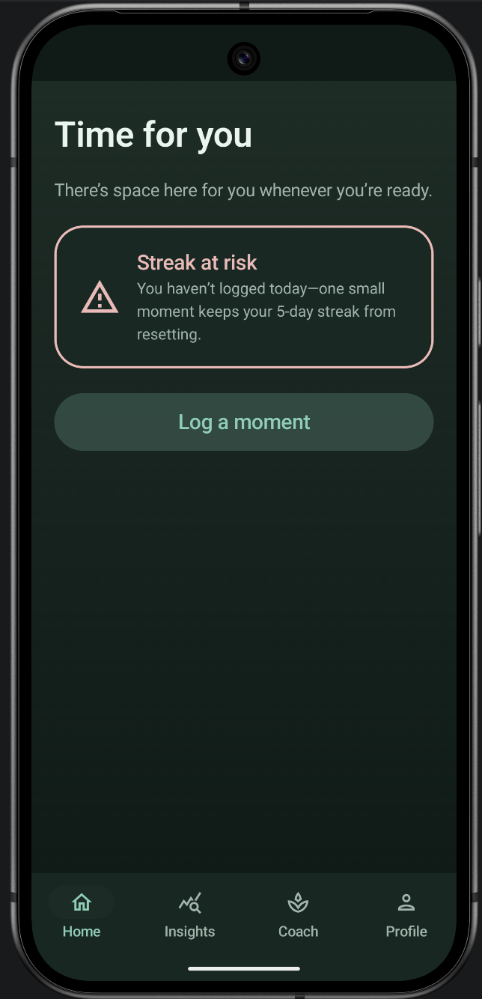
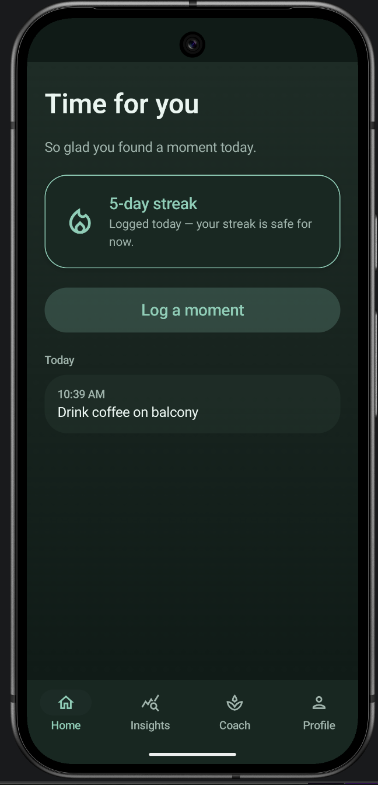
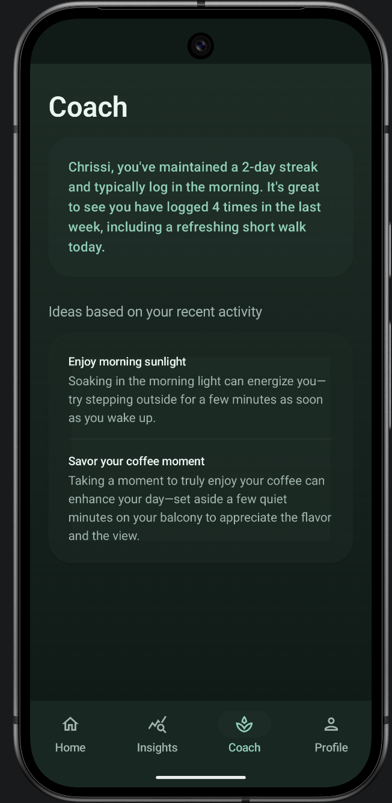
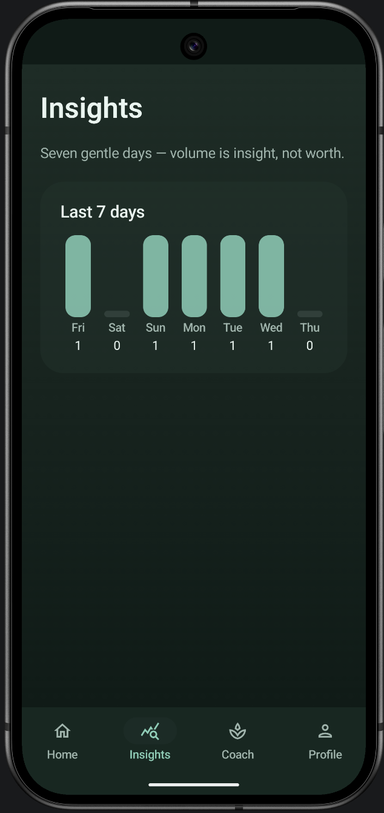
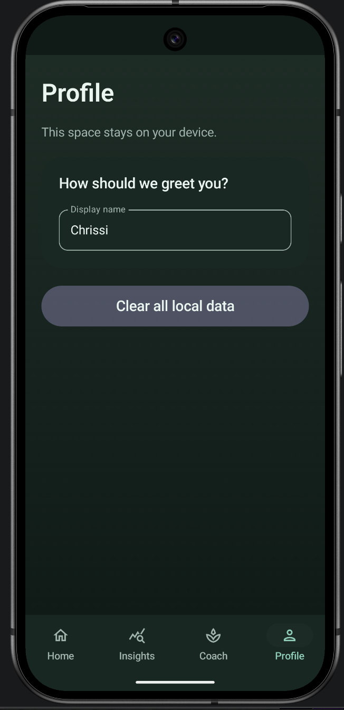

# Time for you — documentation

Visual reference for the main screens, aligned with the current Jetpack Compose UI.

---

## Home

The home hub shows the **“Time for you”** headline, a contextual subtitle, optional **streak** or **streak at risk** card, **Log a moment**, and a **Today** list when you have entries.

### Streak at risk

When you have an active streak but nothing logged today, the app surfaces a warning-style card and encouraging subtitle.

| Element | Role |
|--------|------|
| Title / subtitle | Driven by home state (e.g. gentle prompt when the last calendar day in the window has no log). |
| Streak at risk card | Icon, title, and copy nudging one small log to protect the streak. |
| Log a moment | Primary action to open logging. |
| Bottom nav | **Home** (active), Insights, Coach, Profile. |

### Streak safe + today’s moments

After you log, the streak card reflects a safe state and **Today** lists timestamps and notes.

| Element | Role |
|--------|------|
| Streak card | Flame-style metaphor, streak count, reassurance when logged today. |
| Today section | Cards per moment (e.g. time + short description). |

**Related code:** `HomeScreen`, `HomeStreakCard`, `HomeTodaysMomentsSection`, `HomeViewModel`, domain snapshot via `BuildHomeDashboardSnapshotUseCase`.

---

## Coach

Personalized **insight** text plus **ideas** from recent activity (AI-enhanced when configured, otherwise local rules).

| Element | Role |
|--------|------|
| Coach title | Screen header. |
| Summary card | Short narrative: name, streak, typical log time, recent week context. |
| Ideas section | Title **“Ideas based on your recent activity”** and a card with titled tips and body copy. |

**Related code:** `CoachScreen`, `CoachInsightCard`, `CoachTipsSection`, `CoachViewModel`, `BuildCoachActivitySummaryUseCase`, `GetCoachAdviceUseCase`, `BuildCoachLocalFallbackUseCase`.

---

## Insights

Seven-day **volume** chart with a mindful subtitle.

| Element | Role |
|--------|------|
| Header | **Insights** + quote *“Seven gentle days — volume is insight, not worth.”* |
| Last 7 days card | Bar-style capsules per weekday; count under each day. |

**Related code:** `InsightsScreen`, `InsightsHeader`, `InsightsLastSevenDaysCard`, `InsightsWeekDayBar`, `InsightsViewModel`.

---

## Profile

Local-first messaging, **display name**, and **clear all local data**.

| Element | Role |
|--------|------|
| Title + privacy line | **Profile** and *“This space stays on your device.”* |
| Display name | Text field for greetings (e.g. Coach). |
| Clear all local data | Destructive reset of app-stored data. |

**Related code:** `ProfileScreen`, `ProfileViewModel` (with repository / preferences as wired in the app module).

---

## Navigation

All four tabs use a shared bottom bar: **Home**, **Insights**, **Coach**, **Profile**. The active destination uses a pill highlight and stronger accent on icon and label.

---

## Screenshot files

| File | Description |
|------|-------------|
| `screenshots/home-streak-at-risk.png` | Home when streak needs a log today. |
| `screenshots/home-with-streak.png` | Home with safe streak and **Today** content. |
| `screenshots/coach.png` | Coach insight + ideas. |
| `screenshots/insights.png` | Seven-day chart. |
| `screenshots/profile.png` | Profile and local data controls. |
